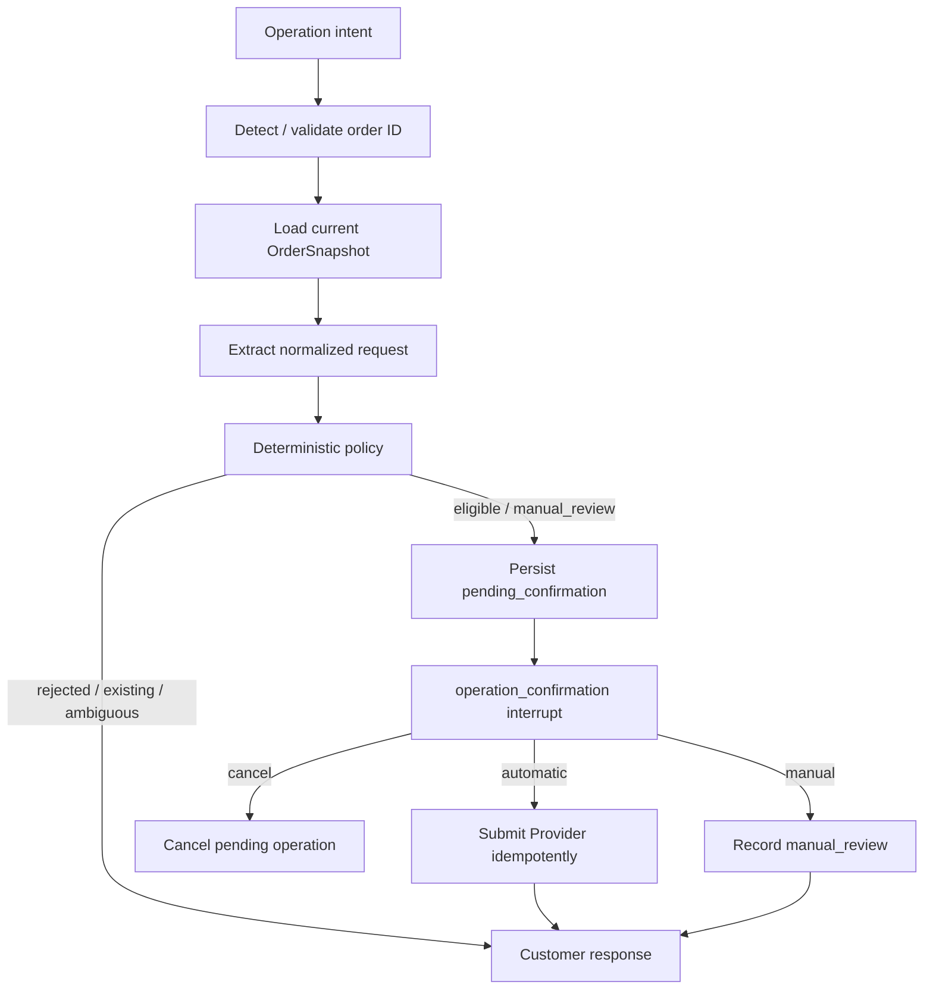

# v0.5 Phase Four Code Proposal

Status: **Implemented and Docker/API validated locally**

Phase four connects the approved v0.5 cancellation, return, exchange, delivery
issue, and support-case-status capabilities to LangGraph. It preserves the
existing v0.4 refund, order inquiry, complaint, risk, and human-handoff paths.
No migration is added in this phase: phase three already created the required
operation tables.

## 1. One required service correction before graph integration

`OperationService.confirm_operation()` now only handles a manual operation and
moves it to `manual_review`. Automatic operations use the dedicated
`submit_confirmed_operation()` service method, which calls the Provider before
persisting `submitted`.

Phase four will therefore add one explicit operation-service method for an
automatic request, conceptually:

```text
pending_confirmation
  -> customer confirms in LangGraph interrupt
  -> provider.submit_operation(request, persisted order_version, provider idempotency key)
  -> one PostgreSQL transaction records confirmation + submitted status + provider reference
```

The Provider receives a stable idempotency key. If it accepts an operation but
the subsequent database write fails, a retry receives the same Provider result
and safely completes persistence. If the Provider rejects the stored order
version as stale, the operation is marked rejected with an audit event and the
customer is asked to start a fresh request; the immutable operation snapshot is
not silently overwritten.

The existing `confirm_operation()` remains the manual-review path. This is a
small correction to the stage-three service boundary, not a workflow redesign.

## 2. New business-intent boundary

`Intent` and the structured intent-router output will gain these values:

- `cancellation_request`
- `return_request`
- `exchange_request`
- `delivery_issue`
- `support_case_status`

The existing values remain unchanged:

- `refund_request`
- `order_inquiry`
- `complaint`

The intent router only selects the broad flow. A new structured operation
extractor runs after an order snapshot has been loaded. It extracts one of the
approved cancellation/return/exchange reason codes, delivery issue type, an
optional exchange variant, and whether a delivery investigation was explicitly
requested.

If a message requests multiple incompatible mutations, such as cancellation and
exchange, the extractor returns `ambiguous`. The graph responds that one order
operation must be selected and creates no operation or case. An LLM never
decides eligibility, priority, or whether a support case is required.

## 3. Demonstration Provider

Phase two deliberately defined only an `OrderProvider` Protocol and a test fake.
The graph needs a non-test implementation, so phase four will add a small
application-scoped demo provider backed by dedicated fixture data.

It will return a complete `OrderSnapshot` with independent order, payment, and
fulfilment fields, including a version, timestamps, currency, eligibility flags,
and available exchange variants. It will retain submissions by idempotency key
for the lifetime of the process. This provider is explicitly for local demo and
tests; it does not change the existing `search_order` refund demo tool.

New v0.5 demonstration scenarios will cover at least:

| Scenario | Purpose |
| --- | --- |
| confirmed + unfulfilled order | automatic cancellation |
| processing fulfilment | P1 manual cancellation review |
| delivered USD 100 return | P1 manual return review |
| shipped with tracking older than 72 hours | P1 delivery investigation |
| marked delivered but not received | P1 delivery investigation |
| unavailable exchange variant | deterministic rejection |

The existing v0.4 order data and refund behavior remain compatible and are not
replaced by this provider.

## 4. Operation subflow

The new nodes live in `src/agent/nodes/operations.py`. They are assembled as a
compiled child graph so the operation lifecycle is separately testable, while
the root graph remains responsible for risk-first routing and final case
handoff.



`order_priority_confirmation` will continue to protect low/medium-risk order
requests. Its “handle order” branch will route to the operation child graph for
the five new intents, while preserving `detect_order` for v0.4 refund and order
inquiry requests.

## 5. Manual-operation and delivery-case handoff

The existing final `finalize_case_handoff` node will be extended with one
additional structured input: approved v0.5 domain policy reason codes. It will
not inspect display text or infer a case from a free-form response.

The phase-three reason-code policies already map these codes deterministically:

- manual cancellation / return / exchange -> `order_operation_review` at P1/P2;
- delivery investigation reasons -> `delivery_investigation` at P1/P2.

Reporting a delivery issue does not mutate an order. However, the graph asks
for one explicit confirmation before it creates a `delivery_investigation`
support case; declining that confirmation creates neither a case nor an order
operation row.

For a confirmed manual operation, the root graph will run:

```text
manual_review persisted -> finalize_case_handoff -> attach_support_case -> END
```

`attach_support_case` stores the returned case ID on the operation record and
adds an immutable `support_case_attached` event. Delivery issues have no
state-changing order operation, so they create/reuse their case through the
existing finalizer but do not create an `order_operations` row.

Existing risk, formal-complaint, human-handoff, and large-refund reasons remain
eligible for the same finalizer and retain their existing precedence.

## 6. Support-case status subflow

For `support_case_status`, a small node uses the existing `CaseService` only
with the LangGraph `configurable.thread_id`. It lists the current thread’s
support cases and returns concise case ID, type, priority, status, and latest
update time. It never accepts a user-supplied thread ID and therefore cannot
read another conversation’s cases.

If the request has no stable thread ID, the node returns a clear message and
does not query the repository. This implements the approved “current thread
only” scope without adding a public API endpoint.

## 7. State, routing, and runtime changes

`RefundState` will add only request-scoped operation fields, reset by
`new_turn_state`, including:

- normalized operation/delivery request facts;
- snapshot and policy-decision summary;
- persisted operation ID/status/action;
- domain manual-review reason codes;
- provider reference and support-case attachment result.

`agent.operations.runtime` will mirror the existing case-service lifecycle:
the FastAPI lifespan constructs the demo Provider and `OperationService`, graph
nodes use providers for dependency injection, and shutdown clears them.

`graph.py` changes only to register the child graph/nodes and add conditional
edges. It keeps its role as workflow assembly; policy and persistence logic stay
outside it.

## 8. Proposed files

New:

- `src/agent/nodes/operations.py`
- `src/agent/operations/demo_provider.py`
- `src/agent/operations/runtime.py`
- `tests/unit_tests/test_operation_nodes.py`
- `tests/unit_tests/test_operation_runtime.py`
- `tests/integration_tests/test_operation_graph.py`

Modified:

- `src/agent/schemas.py`
- `src/agent/prompts.py`
- `src/agent/models.py`
- `src/agent/state.py`
- `src/agent/routing.py`
- `src/agent/graph.py`
- `src/agent/nodes/risk.py`
- `src/agent/nodes/cases.py`
- `src/agent/operations/service.py`
- `src/agent/webapp.py`
- relevant existing graph/routing tests and `README.md`

No existing migration, refund node, refund tool, or applied database table will
be modified.

## 9. Test plan

Offline tests will use the existing test fake and cover:

- each new intent routing to the correct child subflow;
- ambiguous multi-operation requests create nothing;
- confirmation interruption and resume for automatic, manual, and cancelled
  operations;
- duplicate resume/request idempotency;
- Provider stale-version handling;
- manual-operation case creation and operation-to-case attachment;
- delivery investigation creation without an operation row;
- current-thread-only support-case status response;
- no regressions to v0.4 refund, inquiry, complaint, risk, and handoff flows.

PostgreSQL verification remains optional and uses the existing disposable
`CASE_TEST_POSTGRES_URI` convention. Docker Compose is only needed after
offline tests pass.

---

# v0.5 阶段四代码方案

状态：**已在本地实现并完成 Docker/API 验证**。

阶段四把取消、退货、换货、物流问题和当前 thread 的工单状态查询接入 LangGraph；
保留 v0.4 的退款、订单查询、投诉、风险与真人客服流程。本阶段不新增数据库迁移。

核心原则：LLM 只负责识别大类意图和抽取受限的请求字段；订单资格、金额阈值、工单
类型、优先级和是否人工处理仍全部由确定性 policy 决定。

其中有一个必须修正的边界：自动操作不能在 Provider 尚未接受前就标记为 `submitted`。
因此会新增“确认后以稳定幂等键调用 Provider，再把确认、提交状态和 Provider 引用一起
写入数据库”的服务方法。Provider 成功但数据库瞬时失败时，重试会使用同一个幂等键，不
会重复修改订单。

操作子流程为：订单号识别 -> 加载 `OrderSnapshot` -> 结构化抽取请求 -> 确定性 policy
-> 持久化 `pending_confirmation` -> interrupt 确认 -> 自动提交 Provider 或进入人工审核。
人工审核操作会创建/复用 `order_operation_review` 工单并回填 `support_case_id`；物流问题
在用户明确确认后只创建 `delivery_investigation` 工单，不创建订单操作记录。用户拒绝
确认时不会创建工单或订单操作记录。

同时增加 `support_case_status` 意图：只能使用当前 LangGraph `thread_id` 查询本会话工单，
不接受用户输入任意 thread ID。

详细文件计划、状态流转、测试范围和不修改的边界见本文英文部分。
